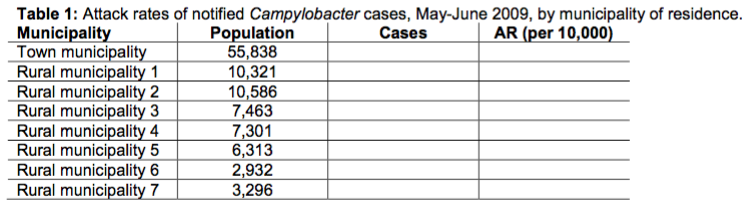
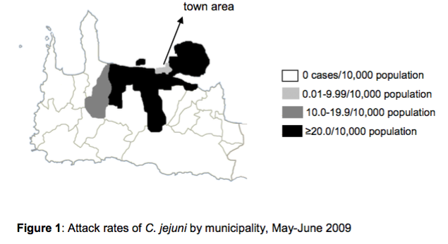
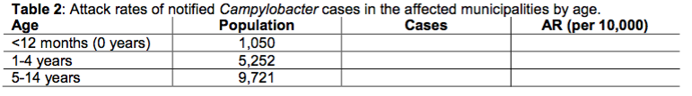
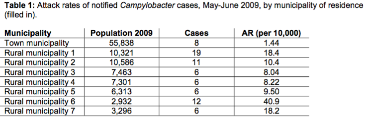
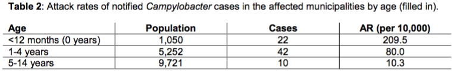

```{r, warning=FALSE, message=FALSE, error=FALSE, comment=FALSE, echo=FALSE}
# Set knitr options to not evaluate anything
knitr::opts_chunk$set(eval=FALSE, warning=FALSE, message=FALSE, error=FALSE, comment=FALSE)
```


#Introduction
Scenario: On 3 June 2009, a local Public Health office in Greece informed the national Centre for Diseases Control and Prevention (HCDCP) in Athens about an unusual increase in C. jejuni cases among children residing in rural areas around the town. The local hospital informed HCDCP that 31 stool samples among children <15 years of age had been tested positive for C. jejuni since 29 May 2009.

> Question 1: What do you know about Campylobacter? Is it known to be causing outbreaks?

> Question 2: What information would you need to be sure whether this is an outbreak?

You check the notified Campylobacter cases in the statutory notification system and see that you have never in the last years seen such a high number of Campylobacter notifications; in fact, there have never been more than 10 notifications per month. No major changes in laboratory practices or the personnel working at the lab have been reported, nor has the mandatory notification system undergone any changes recently.

> Question 3: How do you proceed to investigate the outbreak? What may have caused it?

You are also reminded that an outbreak of Salmonella Typhimurium had been identified in the same area five years earlier. You look at the old outbreak report and find out that tap water had been suspected as the vehicle of the outbreak back then. Given the fact that there is already a sharp decline in cases, you fear that Campylobacter may already be absent from the source(s) of the. Since environmental investigations are likely to show no proof of Campylobacter presence, you need epidemiological evidence for the source of the outbreak.

# Descriptive epidemiology

The outbreak looks to have stopped by the time you go to the outbreak area. You decide to first describe the cases in time, place and person. For this reason, you ask the hospital to inform you about all people with a laboratory diagnosis of Campylobacter since 1 May 2009. A few hours later, you receive information on all these cases in Excel format (campy.xls). Based on the information in this Excel file, describe all cases by time, place and person.

> Task 1: Fill in Tables 1 and 2, and produce an epidemic curve.





#### Help Task 1



> Question 4: Based on these descriptive results by time, place and person, is there any more information you would like to have? Do you have any hypotheses already?


Two different water supply systems exist in the area; one for the town municipality and one for the seven adjacent rural municipalities. The 2004 Salmonella outbreak had affected the exact same rural municipalities, leaving the capital municipality unaffected.

You conduct a case-control study in order to identify the mode and vehicle of transmission: you define cases as laboratory-confirmed Campylobacter cases diagnosed at the local hospital in May-June 2009 and choose controls from the population registry of the affected municipalities, frequency matching for sex and age by one-year intervals (6-month intervals for cases aged below 1 year). In other words, you want to achieve the same age distribution among controls like among cases.

For the rest of this exercise, you will be presented and working with a set of the variables used in the outbreak investigation. All variables presented here have to do with water consumption. The file campy.dta contains information on all cases (like with the Excel file we were using previously), as well as the selected controls.


#Analytical epidemiology
The rest of the case study will be dealing with the analytical epidemiology as part of the outbreak investigation. This consists of univariate and stratified analysis of the case-control study.
The dataset campy.xls contains twenty variables. The first few ones contain demographic information of participants (cases and controls) and the next ones provide information on different exposures directly or indirectly linked to tap water consumption.
For your convenience, here’s a list of the variables in the dataset:

- id: ID of the questionnaire
- case: case or control
- datesym: date of symptom onset (if applicable or available) - age: age of the participant in years
- sex: sex of the participant
- supply: water supply system (1: rural area, 0: town area)
- tap: do you drink tap water?
- bottled: do you drink bottled water?
- filter: do you use a filter for tap water at home?
- well: do you have a well to get water in your property?
- pacifier1: do you use a pacifier?
- pacifier2: is the child’s pacifier washed with tap water? (if applicable)
- dishwasher: do you use the dishwasher for children’s utensils? (if applicable) - microwave1: do you use the microwave to prepare the child’s milk?
- microwave2: do you use the microwave to prepare the child’s food?
- breastfeeding: does the child breastfeed?
- concentrated: does the child drink concentrated milk?
- powder: does the child drink powder milk?
- freshmilk: does the child drink fresh milk?
- dilutetap: is the child’s milk diluted with unboiled tap water?

> Task 2: Load the dataset

> Task 3: How many observations does your dataset have? How many cases and how many controls does it contain?

> Task 4: Can you think of any variables you could generate based on the ones you already have?

> Task 5: Perform a descriptive analysis:
> 
> * What is the age distribution among cases and controls?
> * Do cases and controls differ in terms of age and gender distribution?
>     * Would you use a parametric or a non-parametric test to answer this question? 
> * Draw an epidemic curve.


#### Help Task 2
```{r}
# Set the correct directory
setwd("~/Documents/Projekte/epietr")

# Initalize the epiet package
library(epiet)

# Load data
load(campy)
```


#### Help, Task 3
You can browse the dataset in order to see how it looks like and how many variables it includes. An indirect way of looking how many observations your dataset contains is the **str** command. You can use it for any kind of variable

```{r}
str(campy)
```


#### Help, Task 4
Both powder milk and concentrated milk are types of milk that need to be diluted with water. For this reason, it may be of interest to combine the two to a single variable. For example:
```{r}
campy$diluted <- ifelse(campy$concentrated==1 | campy$powder==1, 1, 0)

# stata commands 
# generate diluted = 1 if concentrated==1 | powder==1
# replace diluted = 0 if concentrated==0 & powder==0
```

The new variable, diluted, contains the information whether a child has been consuming milk that needs to be diluted with water.

#### Help, Task 5
To see if the age distribution between cases and controls differs (which you might not expect, since you have frequency-matched for age), you can use either the t-test or the Wilcoxon’s ranksum test (also called the Mann-Whitney test). The first one can be used only when the distribution of age in both groups is normal. The latter one can be used otherwise.
```{r}
tabulate case
bysort case: summarize age, detail
To test whether the age distribution is normal among both cases and controls, you can run:
bysort case: swilk age //Shapiro-Wilk test1 for both cases and controls swilk age if case==1 //Shapiro-Wilk test for cases
swilk age if case==0 //Shapiro-Wilk test for controls
You can also visualise the distribution of age among cases and controls:
histogram age if case==1, frequency
histogram age if case==0, frequency
Age does not appear to be very normally distributed.
Now that you are absolutely sure that the hypothesis of normality in the variable age is not really the case, you choose to run Wilcoxon’s ranksum test2:
ranksum age, by(case)
If you had gone for the t-test, the command would have been:
ttest age, by(case)

```


We would also like to construct an epidemic curve. There are a couple of ways to do that in R.  

```{r}
plotEpicurve()
```

Packages are commands that have been written by R users, like you. This means that they are not included in Stata when you first install the program. Every time you need to run them for the first time on a new computer, you have to install them. If you know the name of the command you’re interested in, the easiest way is to type findit and the name of the command in the command line while you are online. Then, follow the instructions on your screen. If you are not allowed to do that, run sysdir in Stata, make a note of the “personal” folder and copy the .ado and .hlp files there (you may need to create the folder yourself). User- written commands you may be familiar with are: cctable, cstable, ccinter, csinter, epicurve, etc.


# Univariate analysis
Now that you have already explored the data and performed some descriptive analysis, you should be wondering what really lies in the dataset.

> Task 6: Conduct the univariate analysis; fill in Tables 3a-3e for the first four individual exposures with your results. Then, fill in the summary table 4 on the next page.

- Keeping in mind that we are talking about a dichotomous outcome (case) and dichotomous exposures, which statistical test could we use to see whether there is a statistical association?
- Which measure of association is appropriate for this study?
- Which commands can be used to calculate the measure of the association?
- How many cases and controls live in each water-supply zone?


#### Help, Task 6
The appropriate measure of impact for a case-control study is the odds ratio (OR). This can be calculated with two different commands; cc and cctable3. The first one calculates the odds ratio, 95% confidence interval and the attributable fraction among the exposed and in the population. However, the 2x2 table is arranged in a different way than the one epidemiologists are used to working with (exposure in the rows, case/control in the columns).
```{r}
# cc case breastfeeding
# cc case dishwasher
# cc case supply
# cctable case supply
# cctable case tap-diluted
# cctable case tap-diluted, or
#  the latter command runs cctable for all variables between tap and diluted in the dataset.  the option or in the cctable command sorts the results by the odds ratio.
# Another way to see whether there is an association between two dichotomous variables is, of course, the χ2 test. This does not give you the odds ratio, though.
# tab case bottled, chi2
#  Adding the options col or row, which would provide you the percentages by column or row
# respectively, can help you identify the direction of the association.
# The results (odds ratios and 95% confidence intervals) for the univariate analysis are shown in Table 5 on the next page.

```


# Copyright and License
This case study was first designed and written by Ioannis Karagiannis for the training needs of EPIET, PAE, NorFETP and Austrian FETP fellows of Cohort 16 (2010).

#### Revisions:
* December 2011: Major expansion of background and rationale; addition of preliminary questions; addition of explanation of variables; added help for tasks of descriptive analysis; expansion of the help in the univariable analysis; major expansion of the help provided for the stratified analysis.
* November 2012: Breakdown of background to more questions to facilitate learning; addition of a table and a map for attack rates by municipality and by age group; renamed variable “gender” to “sex” to indicate biological sex; added IDs to dataset; creation and addition of variable “well” to teach confounding; minor changes in the phrasing of the tasks throughout; addition of two-by-two tables for univariate analysis.
* November 2013: Minor clarifications in the background; change of the wording from “case-cohort” to “case-control” throughout; clarifications in the help provided throughout.
* December 2014: None.
* December 2015: Minor clarifications in the background; addition of expected learning outcomes; addition of loops in Stata; addition of an information bubble on user-written commands; minor stylistic improvements throughout.
* March 2016 Translation into R 


#### You are free:
* to Share — to copy and distribute the work
* to Remix — to adapt and build upon the material
Under the following conditions:
* Attribution — You must attribute the work in the manner specified by the author or licensor (but not in any way that suggests that they endorse you or your use of the work). The best way to do this is to keep as it is the list of contributors: sources, authors and reviewers.
* Share Alike — If you alter, transform, or build upon this work, you may distribute the resulting work only under the same or similar license to this one. Your changes must be documented. Under that condition, you are allowed to add your name to the list of contributors.
* Notification — If you use the work in the manner specified by the author or licensor, notify Ioannis Karagiannis (ioannis.karagiannis@phe.gov.uk).
* You cannot sell this work alone but you can use it as part of a teaching.
With the understanding that:
* Waiver — Any of the above conditions can be waived if you get permission from the copyright holder.
* Public Domain — Where the work or any of its elements is in the public domain under
applicable law, that status is in no way affected by the license. * Other Rights — In no way are any of the following rights affected by the license:
   * Your fair dealing or fair use rights, or other applicable copyright exceptions and limitations;
   * The author's moralrights;
   * Rights other persons may have either in the work itself or in how the work is
used, such as publicity or privacy rights.
* Notice — For any reuse or distribution, you must make clear to others the license terms of this
work by keeping together this work and the current license.
This licence is based on http://creativecommons.org/licenses/by-sa/3.0/


